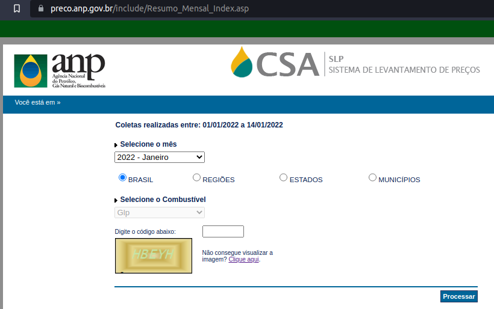
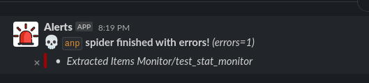
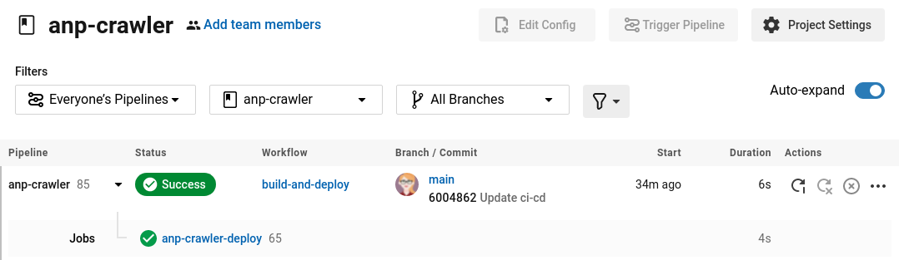

# ANP
## The project
The Agência Nacional do Petróleo, Gás Natural e Biocombustíveis is the regulatory body for activities that make up the oil and natural gas and biofuels industries in Brazil. The ANP is responsible for the Levantamento de Preços de Combustíveis (LPC), which is the most comprehensive survey of automotive fuel and LPG prices in Brazil, which provides references for the market, government agencies and civil society in general. [Read more](https://www.gov.br/anp/pt-br/assuntos/precos-e-defesa-da-concorrencia/precos/precos-revenda-e-de-distribuicao-combustiveis/levantamento-de-precos-de-combustiveis)



This project extracts fuel data from ANP website and loads as jl.gz format on AWS s3.

## Architecture


## Resources
This project currently uses:
- Python 3.9
- Scrapy 2.5.1 ATUALIZAR
- Spidermon 1.16.2 ATUALIZAR

## Pipeline
Here the item extracted by the crawler goes through a standardization layer such as uppercase, strip, type conversion and so on. There is no validation of the data here, just some minor standardizations.

## Crawler Data validation
Validation of generated data using json-schema.
Here is a schema generator based on a sample of the ideal data: [jsonschema.net](https://www.jsonschema.net/home)

The generator schema is basic, to inform mandatory fields and types. With this generated base it is possible to do several other validations using even regex to validate a url or zip code format, for example.

To activate the validator it is necessary:
1. Save the generated schema in a repository folder
2. Inform the schema path in `settings.py`:
```python
SPIDERMON_VALIDATION_SCHEMAS = [
    '../anp_crawler/schemas/anp_default_schema.json',
]
```

3. Enable validation pipeline in `settings.py`
```python
ITEM_PIPELINES = {
    'anp_crawler.pipelines.AnpCrawlerPipeline': 300,
    'spidermon.contrib.scrapy.pipelines.ItemValidationPipeline': 800,
}
```

## Crawler monitoring
Some monitors were implemented to identify problems with the crawler over time, such as unwanted https status, drop in the amount of extracted items, as well as problems in the quality of the extracted data.

If an issue is identified, an alert is sent to a Slack channel.



### Details of monitoring
Two types of monitoring were implemented:
1. During spider execution:
- Unwanted http status number cannot be greater than success status number
- The amount of items extracted after 15 minutes of running must be greater than zero

If monitoring fails on one of the monitors, an action is taken: the spider is terminated and an alert is sent to Slack.

2. At the end of the spider:
- ItemCountMonitor: the amount of extracted items must be greater than or equal to the defined minimum
- ErrorCountMonitor: the amount of errors must not be greater than the defined
- FinishReasonMonitor: the spider shutdown reason must be among the allowed reasons
- UnwantedHTTPCodesMonitor: the amount of unwanted http status should not be more than the threshold
- ItemValidationMonitor: the number of items extracted with errors in data validation cannot be greater than the limit
- HistoryMonitor: the amount of items extracted must reach the minimum defined based on the previous execution history

## Scrapy deployment
### Scrapyd
Scrapyd is a service for running Scrapy spiders. It allows you to deploy your Scrapy projects and control their spiders using an HTTP JSON API. It is a tool for running Scrapy spiders in production on remote servers so you don't need to run them on a local machine.

Scrapyd helps manage multiple Scrapy projects and each project can have multiple versions uploaded, but only the latest one will be used for launching new spiders. 

Scrapyd is an application (typically run as a daemon) that listens to requests for spiders to run and spawns a process for each one, like when we run `scrapy crawl myspider` manually in the terminal. 

[Scrapyd repository](https://github.com/scrapy/scrapyd)
[Scrapyd official docs](https://scrapyd.readthedocs.io/en/stable/overview.html)

To start a spider with `Scrapyd`
```
curl http://<YOUR-EC2-INSTANCE>:6800/schedule.json \
-d project=anp_crawler \
-d spider=anp
```

## CI/CD
This project uses `Circle CI` to manage the deployment of the Github repository to an EC2 instance on AWS.
- [Circle CI config](.circleci/config.yml)
- [Deploy script](.deploy/deploy.sh)



## To run this project in your machine
1. Create an `.env` file and add AWS and Slack credentials:
```python
aws_id = "<YOUR-ID-HERE>"
aws_secret = "<YOUR-SECRET-HERE>"
slack_alert_token = "<YOUR-SLACK-TOKEN>"
```

2. Add your URI on `anp.py` file:
ADICIONAR ISTO NO ENV
`BASE_URI = f's3://da-vinci-raw/crawler-various/anp/run={DATE}/'`

Docker
docker build -t anp-crawler .
docker run anp-crawler

Adicionar makefile